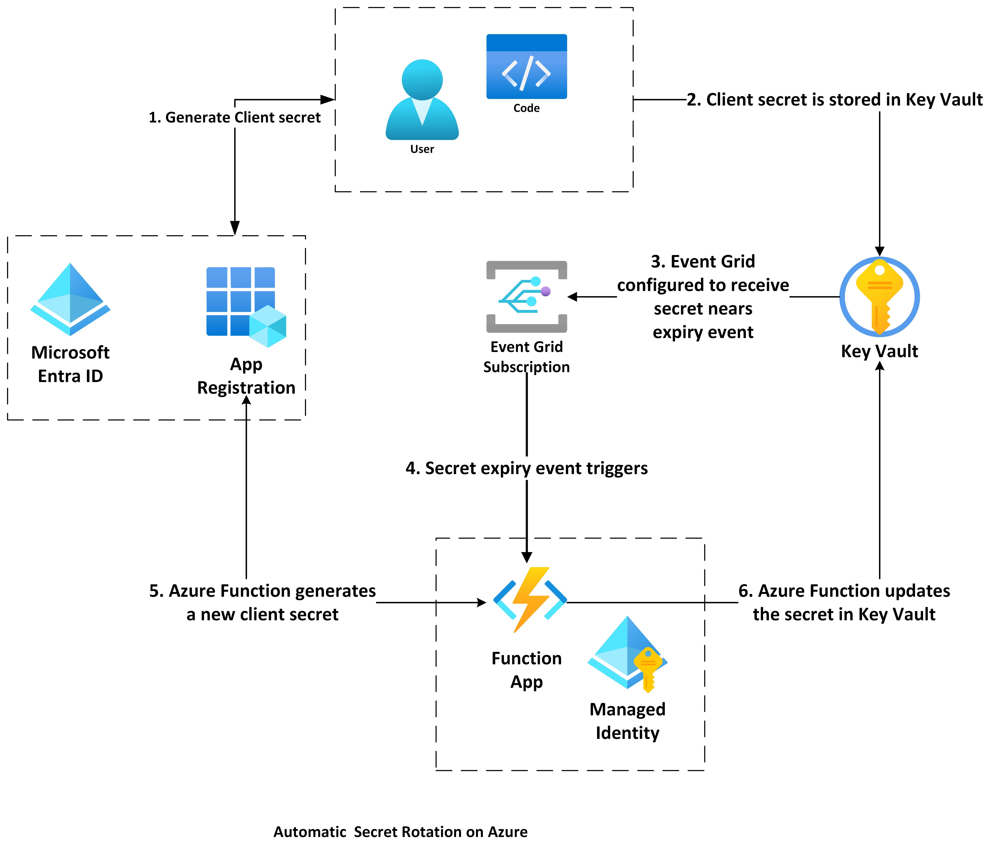

# Zero touch Azure Application registration client secret rotation

This project illustrates the process of configuring automated client secret rotation for [Azure AD app registrations](https://learn.microsoft.com/en-us/azure/active-directory/develop/active-directory-how-applications-are-added) using [Azure Functions](https://learn.microsoft.com/en-us/azure/azure-functions/functions-reference-java?tabs=bash%2Cconsumption) (implemented in python). It integrates [Key Vault](https://learn.microsoft.com/en-us/azure/key-vault/general/event-grid-overview) with [Event Grid](https://learn.microsoft.com/en-us/azure/event-grid/overview) to provide notifications when secrets are nearing expiration.



1. Create a new client secret on an App registration in Microsoft Entra ID by hand or through code
1. Store the client secret in Azure Key Vault
1. Key Vault is set up to send an Event Grid notification when a secret is approaching its expiration date (30 days prior by default).
1. An Azure Function is triggered by this Event Grid notification.
1. The Azure Function generates a new client secret for the Microsoft Entra ID app registration.
1. The Azure Function updates the secret in Key Vault with the new client secret.


## Prerequisites

- [Terraform CLI](https://developer.hashicorp.com/terraform/tutorials/azure-get-started/install-cli)
- [Azure CLI](https://learn.microsoft.com/en-us/cli/azure/install-azure-cli)
- Python installed on machine for locally running the Azure Function
- Azure subscription & resource group
- Azure AD Application Administrator role is needed by the user or identity running the Terraform script to manage all aspects of app registrations and enterprise apps, including assignments.


## Deployment the infrastructure

1. Create a dummy App Registration in Microsoft Entra ID from the Azure Portal. Take note of the `objectId` of the App Registration

1. Generate a client secret on the dummy app registration, copy the `client secret` and the `secret id` for use later.

1. Inspect the project to see how everything is setup

1. Update the `./infra/env/dev.tfvars` file with your environment specifics.

1.  Run the following command to deploy the infrastructure to Azure.


```shell
cd infra
```
initialize the infra directory with terraform
```shell
terraform init
```
Run terraform plan to see which resources would be deployed in a dry run
```shell
terraform plan -var-file="dev.tfvars"
```
Finally run terraform apply to deploy the resources which also include the azure function as well as role assignments for the azure function on keyvault and the app registration
```shell
terraform apply -var-file="dev.tfvars"
```

## How to test the functionality

1.  Open the Azure portal and go to the dummy App Registration. Note down the **objectId** of the App Registration.

2.  Select **Certificates & secrets**.

3.  Choose **New client secret**.

4.  Provide a description and select **Add**.

5.  Save the **id** and **value** of the newly created secret.

6.  Go to the Key Vault in the Azure portal.

7.  Click on **Secrets**.

8.  Choose **Generate/Import**.

9.  Assign the **objectId** of the App Registration as the name of the secret.

10.  Use the **value** of the secret as the secret's value.

11.  Set the **Content Type** to the secret's **id** (not the App Registration id, but the secret's id).

12.  Specify an **Expiration date** that is within the next 30 days.

13.  Click **Create**.

14.  Wait for a few minutes for the Key Vault to notify the Azure Function.

15.  Return to the App Registration in the Azure portal.

16.  Go to **Certificates & secrets**.

17.  Observe that the secret has been updated with a new one. Note the first three characters of the new **Value** and the **Expires** value. You will also notice that the name of the secret has changed to **Set via Azure Function**

18.  Go back to the Key Vault in the Azure portal.

19.  Select **Secrets**.

20.  Open the secret.

21.  Confirm that a new secret version has been created, showing the updated **secret value** and a new **expiration date** set 60 days in the future.
